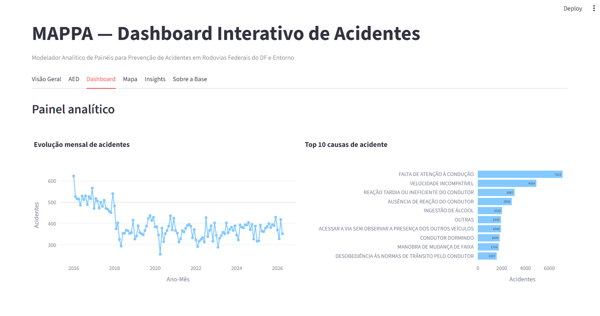

# 🚧 Projeto Integrador II - MAPPA
## 📊 Acidentes de Trânsito em Rodovias Federais

---

📍 Foco nas **Rodovias Federais (BR's)**.  
📈 Identificação de padrões, tendências e fatores de risco.  

---

## 📸 Preview do Projeto

* **LINK DO DashBoard de Visualização dos Dados:**- https://pi-projeto-mappa-k8chey3lbkovgwmtp5kpsn.streamlit.app

---

## 📌 Sobre o Projeto

Este projeto do curso de ciência da computação tem como objetivo desenvolver X.

---

## 🎯 Objetivos

### 🧩 Objetivo Geral
Desenvolver um X.

### 📍 Objetivos Específicos

- 🔍 Identificar padrões e tendências  
- ⚠️ Analisar fatores de risco  
- 🖥️ Desenvolver um **X**  

---

## 💡 Impacto Esperado

Este projeto: Tem como meta desenvolver uma ferramenta baseada nos estudos realizados, que otimize as atividades e avaliações de profissionais de segurança viária, impacto vitál é beneficiar os condutores indiretamente, que utilizam diariamente as rodovias federais do DF e Entorno, especialmente trabalhadores do transporte e da logística, por meio de decisões mais qualificadas baseadas em evidências.

Pode auxiliar:
- 🚗 **Sociedade** condutores das rodovias federais do DF e Entorno
- 🏛️ **Gestores públicos** na tomada de decisão  
- 📚 **Pesquisadores** em estudos de mobilidade  
  
---

## 👥 Equipe

| Nome | Função | GitHub |
|------|------|------|
| VICTOR ALVES RIBEIRO FERNANDES | P.O DO PROJETO | [@VictorFerna](https://github.com/VictorFerna) |
| LUCAS DE SALLES ALMEIDA MOURA | ARQUITETO | [@LucMoura](https://github.com/LucMoura) |
| EUARDO FERNANDES DOS SANTOS ROCHA | ANALISTA DE DADOS | [@EduardoFernandes7](https://github.com/eduardoFernandes7) |
|  | SCRUM MASTER |  |
---

## 🗂️ Estrutura do Repositório

- **📚 Docs/**
- **📚 prototype:**
- **📄 README.md:**

---

## 📊 Status do Projeto

🟡 Em desenvolvimento

